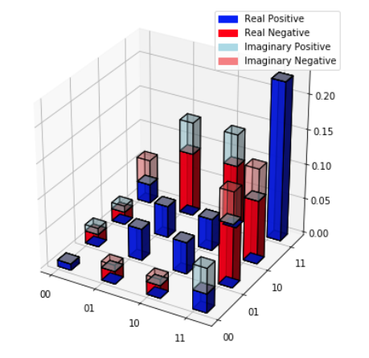

# QuGraphy
Python functions to ease and visualise the calculations of Quantum computation and information Specially for Quantum Cryptography and Quantum Tomography, Here comes the name "QuGraphy".

## What is there?
Currently, Functions that are exist can calculate the reduced density, trace distance and it can visualise the density matrix besides other checking functions that check normalization and the validity of the density matrix and if it is pure state or not.

